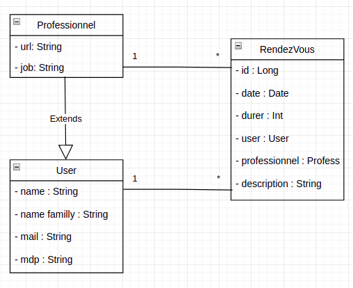

# TP3 MMM : Le framework Spring

###### Guibert Thomas & Koopman Valentin

## GitHub du TP3

Lien : https://github.com/Thomas-Guibert/Spring2020/tree/TP3Final

## GitHub des autres TP

#### TP1 + TP2 partie 1 :

Lien : https://github.com/Thomas-Guibert/tpjpa2021/tree/GuibertDevTP2

#### TP2 partie 2 :

Lien : https://github.com/Thomas-Guibert/JaxRSOpenAPI/tree/GuibertDevT2Part2

## But du TP

Ce TP a pour but de se familiariser avec Spring et d'adapter les TP 1 et TP 2 à celui-ci.

Sur les conseils d'Adrien Le Roch nous n'avons pas réellement fait la première partie du TP qui portait sur le modèle de la banque, nous nous sommes contentés de regarder comment cela était mis en place grace aux exemples donnés dans les liens GitHub.

Pour ce TP, nous nous sommes donc concentrés à l'adaptation des deux Tps précédent à Spring et nous avons commencé la mise en place de Spring AOP.

## Comment lancer le TP

Avant tout pour lancer le projet, il faut mettre en place une base de données, comme une base mysql avec docker (par exemple), avec les commandes :

```
docker run --name some-mysql  -p 3306:3306 -e MYSQL_ROOT_PASSWORD=123 -d mysql:latest
```

```
docker run --name myadmin -d --link some-mysql:db -p 8082:80 phpmyadmin
```

De préférence avec le mot de passe "123" étant utilisé de base dans la configuration du TP.

Il faut y créer une base de données nommée "testspringdata".

Ensuite, il suffit d'exécuter la classe *"SampleDataJpaApplication"* située dans le package *"sample.data.jpa"*.

Puis enfin d'utiliser l'interface générer avec Sagger pour utiliser les controller et ainsi effectuer les modifications sur la base (Il est évidement aussi possible d'utiliser Postman). Pour utiliser cette documentation il faut ce rentre a cette adresse : http://localhost:8080/swagger-ui.html#/

## Les classes métiers

Tout le long de TAA nous avons utilisé un modèle à trois entités:

- User : qui a un ID, un prénom, un nom, un mail, un mot de passe et une liste de rendez-vous
- Professionnel : qui hérite d'User, ils ont tous les paramètres de ce dernier en plus d'avoir une URL et un job
- Rendez-Vous : qui a un ID, une date, une durer, un user, un professionnel et une description

Ainsi un Professionnel et un User peuvent avoir plusieurs rendez-vous et un rendez-vous à un seul User et un seul professionnel (ManyToOne - OneToMany)

Ces classes métiers se trouvent dans le package *"sample.data.jpa.domain"*.

Les classes métier n'ont pas vraiment changé en passant sur Spring. Elle garde les annotations telles que Entity, Id ou ManyToOne. 

Lors du TP2 un problème du chargement infini a été rencontré, en effet le Json qui chargeait un user, chargeait le rendez-vous rattaché, mais il chargeait à nouveau l'User car il était contenu dans celui-ci. C'est pour cela que l'annotation "@JsonIgnore" a été ajoutée.

Voici le diagramme UML des classes métiers :



Nous avons fait ce choix car c'est une structure bien adapter au projet en plus d'etre simple à mettre en place.

## Les DAO avec Spring

Comme vu en cours les DAO en string sont plus simples à mettre en place. Plus besoin de code, seulement des requêtes JPQL.

Les DAO sont trouvable dans le package *"sample.data.jpa.service"*.

## Les controllers

Pour les Controller, nous nous basons sur l'API Rest developpée au TP2, ils servent à agir sur la base de données en utilisant la DAO créée plutôt. Les controller permettent de faire 4 actions : ajouter de nouveaux elements, mettre à jour les attributs des élements, récupérer une ou plusieurs informations contenues dans la base et enfin supprimer des éléments.

Pour passer de Rest à Spring, il a juste fallu adapter le fichier avec les bonnes annotations. Le code est disponible dans le package *"sample.data.jpa.web"*.

## AOP

La partie AOP est située dans le package *"sample.data.jpa.monitor"*. Celui-ci a pour but d'afficher un Logger après l'exécution d'un service dans un controller, en affichant quelle méthode a été executée que ce soit pour User, Professionnel ou RendezVous.

## Amélioration possible et conclusion

À la fin de ce TP nous obtenons le côté backend complet de l'application, il ne manquerait donc que le frontend avec une interface web. Celle-ci n'a pas été faite car elle n'était techniquement pas demandée mais grace aux servlets vus au TP2, nous aurions pu mettre cela en place assez facilement.

Au final, l'UE TAA nous a permis de comprendre et de savoir développer le côté backend d'une application, mais aussi un petit peu frontend avec les Servlets. Cette Ue nous a aussi permis de comprendre le framework Spring (Spring Boot, Spring Data), ce qui nous sera très utile plus tard dans le développement d'application.
